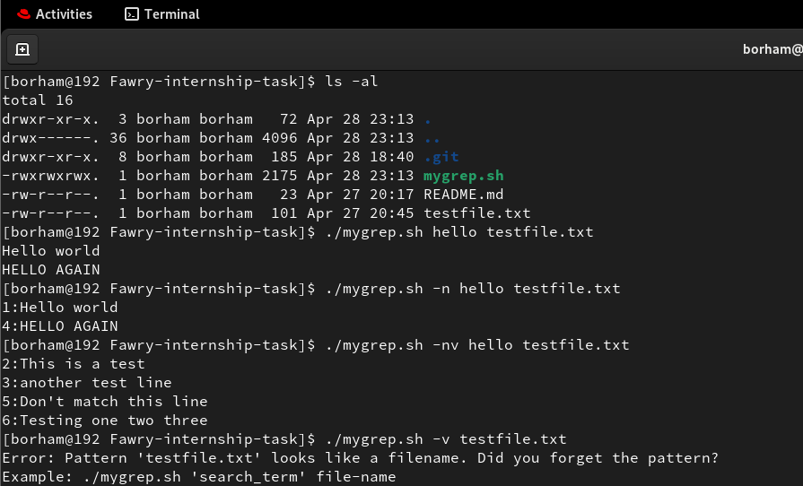
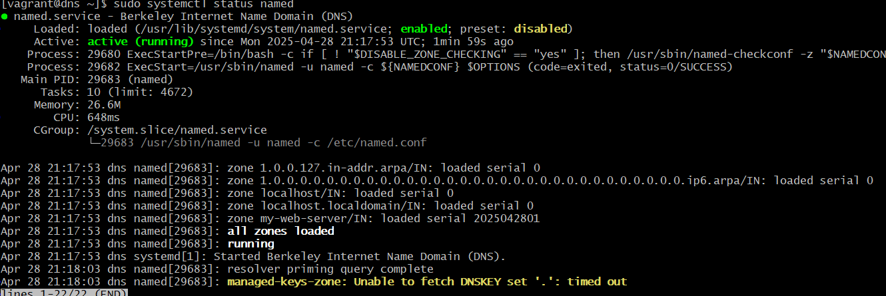
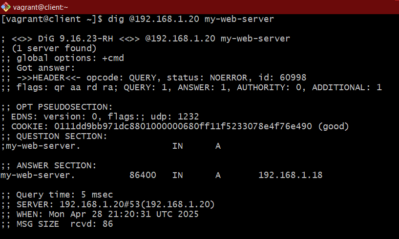
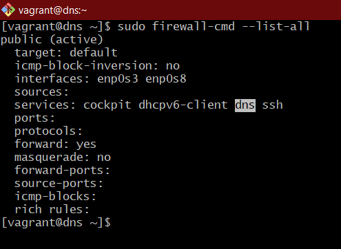
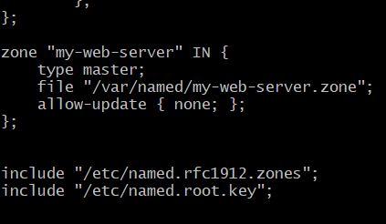
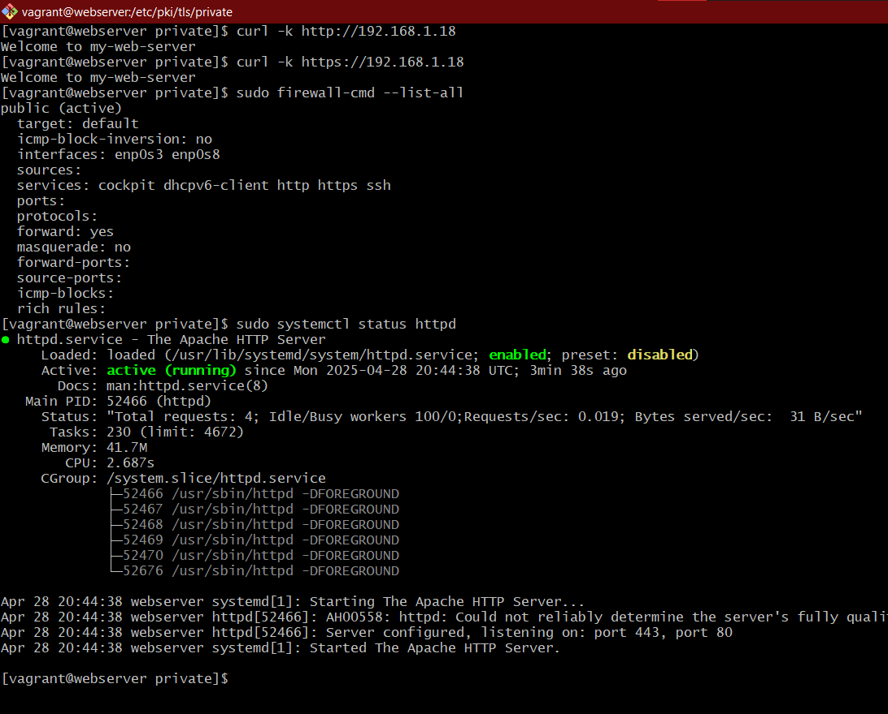
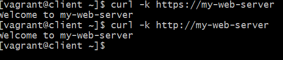
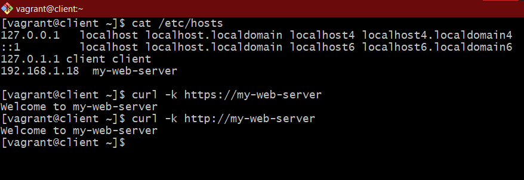

## First Task: Mini Grep

## 📜 Reflective Section

### 1. Breakdown: How the Script Handles Arguments and Options

The script processes input arguments and options as follows:

- **Usage Function**:
  - A `usage()` function displays help instructions when `--help` is passed.

- **Option Parsing**:
  - Variables are initialized: `show_line_numbers`, `invert_match`, `pattern`, and `file`.
  - A loop processes the command-line arguments:
    - `-n` enables showing line numbers.
    - `-v` enables inverted match (prints non-matching lines).
    - `-vn` and `-nv` enable both `-v` and `-n`.
    - `--help` prints help information and exits.
    - Unknown options trigger an error message and the script exits.

- **Positional Arguments**:
  - The first non-option argument is assigned as the **pattern**.
  - The second is assigned as the **file** name.

- **Validation**:
  - The script checks if the pattern looks like a `.txt` file (to avoid swapped arguments).
  - It ensures a file is provided and exists.

- **Search Operation**:
  - The file is read line by line.
  - Matching is **case-insensitive** by converting both the line and pattern to lowercase.
  - Depending on the options (`-n`, `-v`), the script outputs matching or non-matching lines, optionally with line numbers.

---

### 2. If We Added Support for `regex`, `-i`, `-c`, and `-l`, How Would the Structure Change?

If we added support for **regular expressions** and additional options like `-i`, `-c`, and `-l`, the structure would change in the following ways:


- **Regex Support**:
  - Instead of simple string matching, we would use the regex operator in Bash: `[[ "$line" =~ $pattern ]]`.
  - This would allow the use of more complex search patterns, but special attention would be needed to handle and format special characters properly.

- **-i (Ignore Case)**:
  - Implementing `-i` would actually be easier than the other options because it simply requires converting both the pattern and the line to lowercase before performing the match.
  - Since the matching is case-insensitive by nature, adding the `-i` flag would just involve checking if the flag is set and then converting both the pattern and the line to lowercase. This doesn’t require major changes to the main search logic, making it a relatively simple addition.

- **-c (Count Only Matches)**:
  - A `match_count` variable would be added to count the matches.
  - Instead of printing each matching line, the script would simply count and print the total number of matches at the end.

- **-l (List Only Matching Filenames)**:
  - For each file, the script would print the filename once a match is found and stop processing that file.

---

### 3. What Was the Hardest Part and Why

The hardest part for me was distinguishing between the pattern and the file name. This is important because sometimes the pattern might resemble a filename, and the script could misinterpret it.

To handle this, I used the .txt extension as a way to differentiate between the two. I added a check that verifies if the pattern looks like a .txt file, in which case it outputs an error, alerting the user that they might have swapped the pattern and the file.

This logic ensured that the pattern and the file were correctly assigned, and it helped prevent potential errors in the script.

---
## 📸 Screenshots

Here are the screenshot of the terminal running the script:

---
## Second Task: The Scenario
### Internal Dashboard Connectivity Lab

This repo documents a simulated troubleshooting exercise for an internal web dashboard (`my-web-server`) that became unreachable. We built a small three-VM lab, diagnosed DNS/network issues, and restored full connectivity.

---

### 🔧 Lab Setup

We deployed **three Virtual Machines** on an isolated “Internal Network”:

| VM     | Role        | IP Address      | 
|--------|-------------|-----------------|
| DNS    | BIND9 server| `192.168.1.20` |
| Web    | Apache HTTPD| `192.168.1.18` |
| Client | Test host   | `192.168.1.19` | 

---

### 🛠 Troubleshooting Steps & Fixes

| Problem                                              | Solution                                                                            | Screenshot                                |
|------------------------------------------------------|-------------------------------------------------------------------------------------|-------------------------------------------|
| DNS server only answered on localhost                | Reconfigured BIND to listen on all interfaces                                       |  |
| Client using wrong DNS                                | Pointed the client’s resolver to our internal DNS VM (`192.168.1.20`)               |   |
| Firewall blocking DNS                                 | Opened port 53 on the DNS VM’s firewall                                             |  |
| Zone file misconfigured                               | Fixed A-record in the zone file to point `my-web-server` → `192.168.1.18`           |     |
| Firewall blocking HTTP/HTTPS                          | Opened ports 80 & 443 on the Web VM’s firewall                                      | |
| Self-signed cert warnings                             | Trusted the self-signed certificate on the Client or swapped in a CA-signed cert     |    |

---

### 🏆 Bonus: DNS Bypass via `/etc/hosts`

To prove connectivity even with DNS broken, we added a hosts-file override on the client:
 
```text

